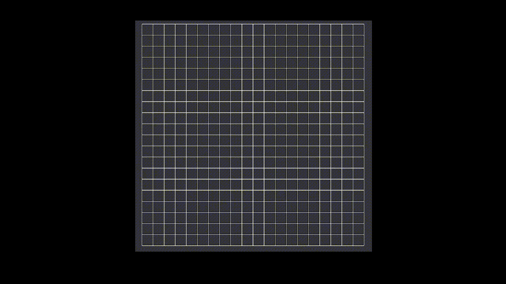

# Maze Generator
 
This repository contains the source code for the project to build mazes of varied types.

The generator is based on DFS algorithm.
Settings for generation and visualization can be tweaked in the instance of MazeGenerator object in the world.

Following image shows the generation process (slowed down for visualization).

